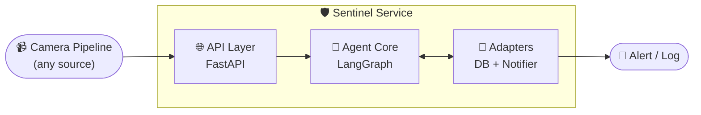

# 🛡️ Sentinel

**A pluggable agentic reasoning layer for video surveillance systems.**

Instead of alerting on every camera detection, Sentinel checks history, reasons about context, and decides: escalate, log as false alarm, or flag for human review — with persistent memory of past decisions and a real feedback loop to correct itself over time.


---

## 📋 Table of Contents
- [🎯 The Problem](#-the-problem)
- [⚙️ What Sentinel Does](#️-what-sentinel-does)
- [🏗️ Architecture](#️-architecture)
- [🔄 How It Works](#-how-it-works)
- [✅ Validated Against a Real Pipeline](#-validated-against-a-real-pipeline)
- [🧠 Design Decisions](#-design-decisions)
- [🚀 Getting Started](#-getting-started)
- [📡 API Reference](#-api-reference)
- [📁 Project Structure](#-project-structure)
- [🔮 What I'd Build Next](#-what-id-build-next)

---

## 🎯 The Problem

Detection models (YOLO, transformers, whatever) are good at pattern-matching, bad at judgment. Point one at a loading dock and it'll flag every delivery worker as "loitering." Real security teams don't want more alerts — they want fewer, *better* ones. That's a reasoning problem, not a detection problem, and it's not something you fix by tuning a confidence threshold.

## ⚙️ What Sentinel Does

- 🧩 **Reasons before alerting** — checks an incident's history before deciding, using LLM tool-calling, not hardcoded thresholds
- 📈 **Learns from real outcomes** — a human can confirm or reject any flagged incident after the fact; that ground truth feeds back into future decisions, so history isn't just the agent grading its own guesses
- 🔌 **Domain-agnostic core** — the reasoning loop has no idea "camera" or "security" exists; it just sees generic events, tools, and a decision policy. The same core would work for fraud alerts, network intrusion, or IoT sensors, not just cameras
- ⏱️ **Deduplicates in real time** — a cooldown window prevents one ongoing event from spamming a fresh LLM call and alert every few seconds
- 🔄 **Provider-agnostic by construction** — built against Claude, swapped to Gemini's free tier with a 2-line change, zero changes to the agent logic itself
- 💾 **Persistent, not just in-memory** — conversation state survives process restarts (SQLite-backed LangGraph checkpointing), and every incident is logged to a real database, not just printed to a console

## 🏗️ Architecture



`source.py` and `notifiers.py` are the only pieces that know anything about the outside world. The agent core (`agent/graph.py`, `agent/tools.py`) never imports either directly — it receives them as injected dependencies. Swap a camera pipeline for a fraud-detection feed, or a console print for a Slack webhook, and the reasoning engine doesn't change by a single line.

## 🔄 How It Works

1. 📥 An event arrives at `POST /events` — camera ID, event type, confidence, timestamp.
2. 🤖 The agent (LangGraph `StateGraph`) is handed the event plus three tools: `query_past_incidents`, `escalate_to_security`, `flag_for_human_review`.
3. 🔍 It calls `query_past_incidents` first — this hits a real SQLite table of prior decisions for that camera + event type, not a hardcoded answer.
4. 🧭 Based on real history, it applies an explicit decision policy: decisive "no escalate" when history is a clean pattern of false alarms, escalate when history is empty or shows real past incidents, human review only when genuinely mixed.
5. 📝 The decision, and the incident, get logged back to the database — including an ID a human can later use to confirm or correct it via `PATCH /incidents/{id}/resolve`.
6. ♻️ That correction becomes part of history for the *next* decision. The system gets more trustworthy the longer it runs, instead of statically repeating the same judgment forever.

## ✅ Validated Against a Real Pipeline

This isn't tested only against synthetic events. It's wired end-to-end to a real YOLO26x + MViTv2-S smoking-detection pipeline over a live WebSocket bridge (`bridge.py`) — real video, real inference, real detections flowing into real agent reasoning.

> **⚠️ Honest limitation, documented on purpose:** on CPU-only hardware, sustaining live RTSP inference indefinitely hit genuine throughput limits — dropped frames, read timeouts, detection accuracy trade-offs at different frame rates. This is a textbook production CV constraint (it's *why* real deployments use GPUs or frame-sampling strategies), not a bug in Sentinel's reasoning layer. Diagnosed the cause (blocking inference starving the stream's read loop), tried several mitigations (frame-rate throttling, dropping audio, TCP transport), and confirmed multiple clean, correct, real detections end-to-end rather than chasing indefinite live uptime the hardware was never going to sustain.

## 🧠 Design Decisions

**Why ports-and-adapters, not a monolith?**
Because the interesting part of this project isn't "an agent that watches my specific camera" — it's a reasoning architecture that survives being pointed at a different camera system, or a different security domain entirely, without a rewrite.

**Why LangGraph over a hand-rolled loop?**
It wasn't the starting point — the reasoning loop was first built from scratch (plain tool-calling against the message API) specifically to understand the mechanism before adopting a framework that abstracts it. LangGraph was adopted once that loop was understood, for checkpointing and explicit state control a hand-rolled `while` loop doesn't give you for free.

**Why a real database instead of an in-memory list?**
Because "the agent remembers its past decisions" is a meaningless claim if it evaporates on restart. SQLite-backed checkpointing plus a real incidents table means history is durable and auditable, not a demo trick.

## 🚀 Getting Started

```bash
git clone https://github.com/ahmed-askri/Sentinel.git
cd Sentinel
pip install -r requirements.txt
```

Create a `.env` file:

GOOGLE_API_KEY=your-key-here

*(free, no credit card — from [aistudio.google.com](https://aistudio.google.com))*

```bash
python main.py                              # batch test against events.json
uvicorn api.app:app --reload --port 8001    # real-time API
```

## 📡 API Reference

| Method | Endpoint | Purpose |
|---|---|---|
| `POST` | `/events` | Submit a detection event, get back a reasoned decision |
| `PATCH` | `/incidents/{id}/resolve` | Human confirms/rejects a past decision, updating real history |

**Example:**
```bash
curl -X POST http://localhost:8001/events \
  -H "Content-Type: application/json" \
  -d '{"camera_id": "cam_01", "event_type": "loitering", "confidence": 0.81, "timestamp": "2026-09-10T23:47:00", "location": "loading dock"}'
```

## 📁 Project Structure

sentinel/
├── agent/
│ ├── graph.py # LangGraph reasoning loop + system prompt
│ └── tools.py # query_past_incidents, escalate, flag_for_review
├── api/
│ └── app.py # FastAPI: /events, /incidents/{id}/resolve
├── incident_db.py # Real SQLite incident log + human feedback
├── notifiers.py # Swappable alert backends (console/webhook)
├── source.py # Swappable event sources
├── config.py # Env-driven configuration
├── bridge.py # WebSocket bridge to a real CV pipeline
└── main.py # Batch-mode test entry point


## 🔮 What I'd Build Next

- ⚡ Async request handling (currently synchronous; blocks under concurrent cameras)
- 🔐 API key authentication on `/events`
- 🐳 Docker packaging for one-command deployment
- 📊 A companion evaluation pipeline (in progress separately) to measure decision accuracy against a real scenario suite, not just eyeball correctness

---

*Built by [Ahmed Askri](https://github.com/ahmed-askri) — Computer Science Engineering student, ENSI Tunisia.*
